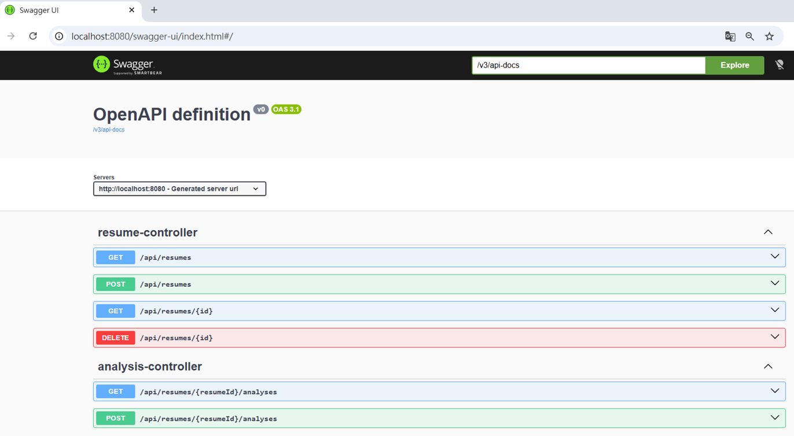
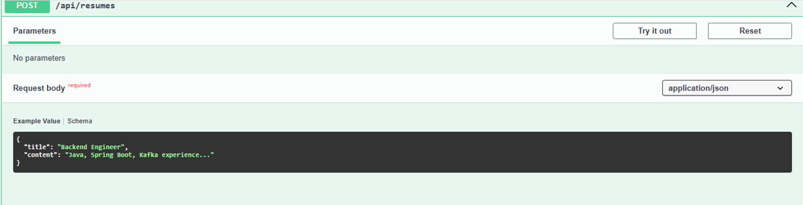
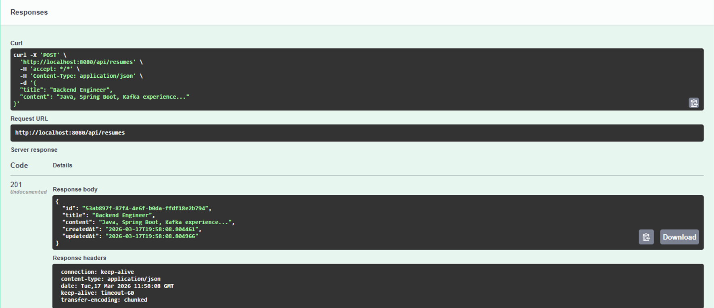
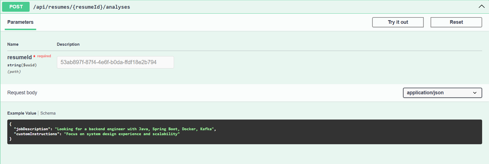
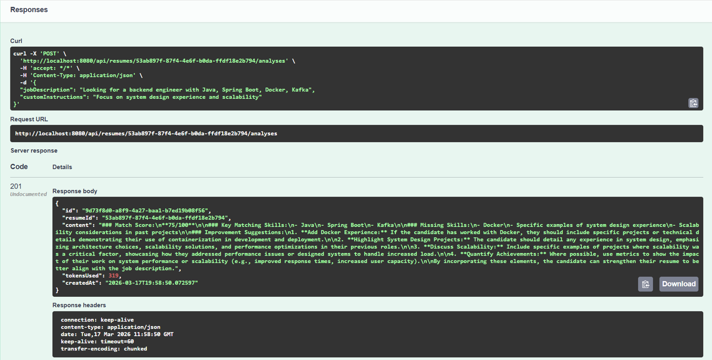

#  AI Resume Analyzer

A Spring Boot backend service that analyzes resumes using AI.

---

##  Features

* Submit and manage resumes
* AI-powered resume analysis
* Compare resume with job description
* Provide actionable improvement suggestions

---

##  Tech Stack

* Java 17 + Spring Boot
* PostgreSQL + Flyway
* OpenAI API
* Swagger (API testing)

---

## 🏗 Architecture

```
Controller → Service → Repository → DB
                    ↓
                 AI Client → OpenAI
```

---

##  Demo

### API Overview



### Submit Resume





### Analyze Resume



### Result



---

##  Run

```bash
docker-compose up -d
export OPENAI_API_KEY=your_key
./mvnw spring-boot:run
```

Swagger:

```
http://localhost:8080/swagger-ui/index.html
```

---

##  Highlights

* UUID + Flyway for schema management
* FK + index for performance and integrity
* Global exception handling
* Clean layered architecture
* AI integration via abstraction layer

---

##  Purpose

Demonstrates backend system design and AI integration.

---
